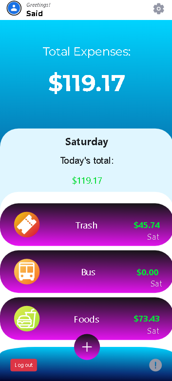

# Blog-App

The Blog app will be a classic example of a blog website. I will create a fully functional website that will show the list of posts and empower readers to interact with them by adding comments and liking posts.

## Screenshot

## Built With

- Ruby on Rails
- PostgreSQL
- Bootstrap
- SCSS, CSS
- Gems (Gemfile)
- Linters (Rubocop)
- VSCode
- Git Bash
- GitHub

## Getting Started

To get a local copy up and running follow these simple example steps.

### Prerequisites

- Laptop or Desktop
- Web Browser
- Ruby (installed and set up)
- IDE (preferably Visual Studio Code)
- Programming Knowledge

### Installation, Setup and Usage

 **Clone this [repo](https://github.com/udeaghad/recipe-app)**
- Navigate to the correct directory **cd Budget-app** (case sensitive)
- Run **bundle install** in your terminal (in case you need to update the gems run **bundle update**)
- Please run **npm init -y** and **npm install** if you want to test the css linters
- To setup database and tailwind run the following commands:
  - `Inside of config folder create local_env.yml file and add key-value pair for db access (ex BUDGET_APP_DATABASE_USERNAME: yourusername and BUDGET_APP_PASSWORD: yourpassword`
  - `Go to my config/application.rb and copy the code (before_configuration block) and paste it to your file.`
  - `rails db:create`
  - `rails db:migrate`
- Run **rails s** in your terminal
- Enter **http://localhost:3000/ or localhost:3000** on your browser to view page
- **Congratulations!!! App should run successfully.**

## Author

👤 **Said Rasinlic**

- GitHub: [@GitHub/SaidRasinlic](https://github.com/SaidRasinlic)
- Twitter: [@Twitter/SaidRasinlic](https://twitter.com/SaidRasinlic)
- LinkedIn: [@LinkedIn/SaidRasinlic](https://www.linkedin.com/in/SaidRasinlic)

## 🤝 Contributing

Contributions, issues, and feature requests are welcome!

Feel free to check the [issues page](../../issues/).

## Show your support

Give a ⭐️ if you like this project!

## Acknowledgments

- Microverse 

## 📝 License

This project is [MIT](LICENSE) licensed.

## Getting Started

To get a local copy up and running follow these simple example steps.
### Setup
 **clone this [repo](https://github.com/udeaghad/recipe-app)**
### Install

- **Install Ruby**
- **Install Rails**
- **Install Postgresql or any RDMS that suits you** 
- Run **rails db:create**
- Run **rails db:migrate**

### Usage
- navigate to the directory **cd Recipe-app** (case sensitive)
- Run **bundle install** on your terminal (in case you need to update gems run **bundle update**)
- To setup database and tailwind run the following commands:
  - `rails db:create`
  - `rails db:migrate`
  - `rails db:seed` (to populate initial data from db/seeds.rb file)
  - `rails tailwindcss:build` (to build necessary configurations for tailwind)
- Run **rails s** on your terminal
- Enter **http://localhost:3000/ or localhost:3000** on your browser to view page
- **Congratulations!!! App should run successfully.**
