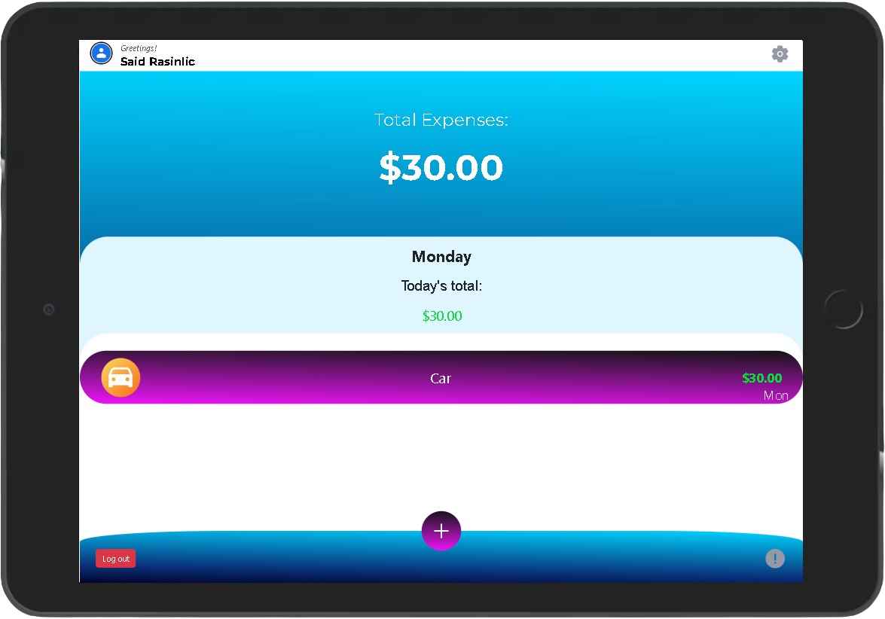

# Budget-App

This Ruby on Rails capstone project is about building a mobile web application where you can manage your budget: you have a list of transactions associated with a category, so that you can see how much money you spent and on what.

## Screenshot

</>

## Built With

- Ruby on Rails
- PostgreSQL
- Bootstrap
- SCSS, CSS
- Gems (Gemfile)
- Linters (Rubocop)
- VSCode
- Git Bash
- GitHub

## Getting Started

To get a local copy up and running follow these simple example steps.

### Prerequisites

- Laptop or Desktop
- Web Browser
- Ruby (installed and set up)
- IDE (preferably Visual Studio Code)
- Programming Knowledge

### Installation, Setup and Usage

- **Clone this [repo](https://github.com/SaidRasinlic/Budget-App)**
- Navigate to the correct directory **cd Budget-app** (case sensitive)
- Run **bundle install** in your terminal (in case you need to update the gems run **bundle update**)
- Please run **npm init -y** and **npm install** if you want to test the css linters
- Setup database configuration in config/database.yml and use your correct username and password to access PostgreSQL db
- In your terminal run the following two commands:
  - `rails db:create`
  - `rails db:migrate`
- Run **rails s** in your terminal to start the server.
- Enter **http://localhost:3000/ or localhost:3000** on your browser to view page
- **Congratulations! App should run successfully.**

## Author

👤 **Said Rasinlic**

- GitHub: [@GitHub/SaidRasinlic](https://github.com/SaidRasinlic)
- Twitter: [@Twitter/SaidRasinlic](https://twitter.com/SaidRasinlic)
- LinkedIn: [@LinkedIn/SaidRasinlic](https://www.linkedin.com/in/SaidRasinlic)

## 🤝 Contributing

Contributions, issues, and feature requests are welcome!

Feel free to check the [issues page](../../issues/).

## Show your support

Give a ⭐️ if you like this project!

## Acknowledgments

- Microverse 

## 📝 License

This project is [MIT](LICENSE) licensed.
